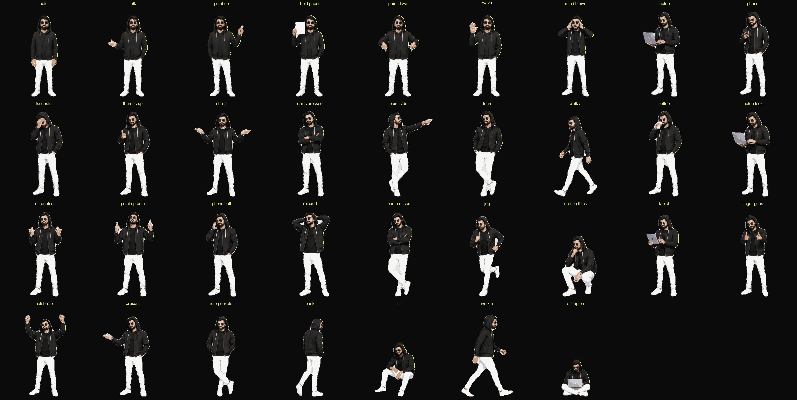

# Anadi — full-body pixel character (final)

The reel character for @soulisanadiii: slim, black hoodie with the hood up, round dark shades,
beard, white slim trousers, white sneakers. It's 2px pixel art (270×280 grid on a 540×560
canvas), has 12 poses, lip-syncs to a voiceover, and acts out one pose per line.



**Poses:** `idle` `talk` `point_up` `hold_paper` `point_down` `wave` `laptop` `phone`
`facepalm` `shrug` `mind_blown` `thumbs_up`

## Use it in a reel (Remotion)

```tsx
import { CharacterActor, type PoseCue } from "../character/Character";
import { SEG } from "./timing";        // voiceover segments: { name: { start, end, next } } in seconds
import { LIPSYNC } from "./lipsync";   // from avatar/lipsync.py (below)

const SCRIPT: PoseCue<keyof typeof SEG>[] = [
  { from: "hook1", pose: "talk" },
  { from: "hook2", pose: "hold_paper" },
  { from: "c1e",   pose: "facepalm" },
  { from: "c3b",   pose: "thumbs_up", flip: true },   // flip = mirror
];

<CharacterActor script={SCRIPT} segs={SEG} lipsync={LIPSYNC} frame={frame} height={1100}
  css={{ left: 0, top: 700 }} />
```

- A pose starts 3 frames before its line, passes through `idle` for 2 frames, then lands with a
  squash → overshoot bounce. Pass `inbetween={false}` to cut straight to the new pose instead.
- `offset={n}` delays the voiceover when it starts n frames after the start of the composition.
- For a one-off pose without a script, use `<Character pose="shrug" frame={frame} sincePose={…} viseme="a2" />`.
- `height` 1000–1150 is full-body in a 1080×1920 reel.

### Lip-sync track for a new voiceover

```bash
~/reel-rig/openvoice/.venv/bin/python3 ~/reel-rig/avatar/lipsync.py public/<reel>/vo.wav src/<reel>/lipsync.ts
```

This is the same track format the 128px head avatar (`PixelAvatar`) uses, so one file drives both.

## Rebuild

```bash
~/reel-rig/character/build.sh
```

The build cuts the poses out of the two Canva sheets (`sheets/`), lines up their faces, pixelates
them, draws the mouths and review boards, and copies `illustrated/ pixel/ pixel_mouths/` into
`remotion/public/character/`.

| file | what it does |
|---|---|
| `build_character.py` | cutouts → face alignment → `illustrated/`, `pixel/` (2px). Add args `2 1 3` to also build the 1px and 3px alternates |
| `build_mouths.py` | 7 speech mouths (a1 a2 a3 e1 e2 o1 o2) per pose → `pixel_mouths/`; `rest` is the pose's own mouth |
| `review_mouths.py` | `mouth_board.png`: every pose × every mouth, face zoomed |
| `character_sheet.py` | `character_sheet.png`: all 12 poses |
| `remotion/src/character/Character.tsx` | `Character`, `CharacterActor`, `poseAt`, `heldVisemes`, `CharacterPreview` |
| `remotion/src/character/CharacterTalkDemo.tsx` | review demo (composition `CharacterTalkDemo`) |

## How it moves

- **Face alignment:** every pose is scaled (≤3.6%) about the feet so the mouth sits at canvas
  (270, 121), so the head doesn't jump when the pose changes.
- **Breathing / nod:** only the upper body moves, by one pixel cell. The sprite is split at the
  hoodie (`SEAM = 290`), so the feet stay planted.
- **Mouth:** each shape is held for at least 2 frames (`heldVisemes`), so the mouth reads as
  rhythm rather than flicker.

## Known limitations

- At full-body size the mouth is about 8×3 cells (~20px on a phone), so it reads as "talking",
  not as clear lip shapes. The 8 shapes come down to about 4: closed, open, wide/teeth, round.
- The lip-sync follows loudness and pitch, not the actual words, so the rhythm is right but the
  shapes aren't matched to specific sounds.
- `mind_blown` has its open "O" mouth drawn in, so it doesn't lip-sync. Use it for reactions.
- Face alignment makes the feet slide a little on some switches (hold_paper 13px, wave 6px,
  the rest ≤5px).
- The nod moves the whole upper body, not just the head, because there's no separate head layer.
- `phone`'s drawn mouth is a tilted smirk, but the speech shapes are straight.

## History

`_archive/` has the earlier explorations: the 1px and 3px versions, comparison boards, and
`v1_before_face_alignment/`. Demo renders are in `~/reel-rig/out/character_*`.
